# Tweet Entity Linking System (TELS)

## Project Overview
**Note**: This project was developed as the final assignment for the **Data Mining II** course. It serves as an educational implementation of Entity Linking concepts.

This system implements an end-to-end Entity Linking (EL) pipeline designed for short, noisy text (Tweets). It identifies entity mentions and links them to Wikipedia pages, handling challenges like hashtags and informal grammar.

## Architecture

```mermaid
graph LR
    Input((Input Tweet)) --> Prep[Preprocessing]
    Prep --> Cand[Candidate Generation]

    subgraph Knowledge Base
    direction TB
    Index[(Inverted Index)]
    Context[(Entity Context)]
    end

    Cand -.-> Index
    Cand -.-> Context
    Cand --> Feat[Feature Extraction]

    subgraph Ranking Models
    direction TB
    XGB[XGBoost]
    DNN[Deep Neural Net]
    SVM[SVM]
    end

    Feat --> XGB & DNN & SVM
    XGB & DNN & SVM --> Output((Linked Entities))

    style Input fill:#e1f5fe,stroke:#01579b
    style Output fill:#e8f5e9,stroke:#2e7d32
    style Prep fill:#fff9c4,stroke:#fbc02d
    style Feat fill:#fff9c4,stroke:#fbc02d
```



1.  **Preprocessing**:
    *   Cleans raw tweets by removing URLs, user mentions, and special characters.
    *   **Crucial Step**: Splits CamelCase hashtags (e.g., `#TheForceAwakens` -> "The Force Awakens") to ensure proper n-gram generation and dictionary lookup.

2.  **Candidate Generation**:
    *   Generates n-grams (up to the full length of the tweet).
    *   Retrieves candidate entities using a dictionary-based approach backed by an LMDB inverted index.
    *   Fetches entity context (PageRank, PageViews, Categories) from a fast key-value store.

3.  **Feature Extraction**:
    *   Computes a rich set of features for each mention-entity pair, including:
        *   **Commonness (CMNS)**: Prior probability of an anchor linking to a page.
        *   **Contextual Overlap**: Jaccard similarity between tweet tokens and entity context (anchors, categories).
        *   **Graph Metrics**: PageRank and PageViews to measure entity popularity.
        *   **Coherence**: Semantic relatedness between the mention and the candidate entity.

4.  **Ranking Models**:
    *   **DNN (Deep Neural Network)**: A custom PyTorch model with residual blocks, batch normalization, and dropout. Best for generalization.
    *   **XGBoost**: Gradient boosted decision trees. Provides high precision on seen data.
    *   **SVM**: Support Vector Machine with a polynomial kernel. Serves as a strong linear baseline.

## Design Decisions

### Preprocessing Strategy
Twitter data is highly informal. A key design decision was to implement robust CamelCase splitting. Standard tokenizers often treat hashtags as single unknown tokens. By splitting them, we recover the semantic content (e.g., "The Force Awakens") allowing the system to link hashtags to their respective entities.

### Model Selection
*   **XGBoost** was chosen for its ability to handle non-linear feature interactions and high performance on tabular data.
*   **DNN** was implemented to leverage deep learning for potential latent feature extraction and better generalization on unseen datasets (NEEL-Dev).
*   **SVM** provides a robust baseline to ensure that complex models are actually adding value.

## Usage

### Prerequisites
*   Python 3.10+
*   PyTorch, Scikit-learn, XGBoost, LMDB

### Installation
Clone the repository and install dependencies:
```bash
pip install -r requirements.txt
```

### Inference
To link entities in a single tweet:
```bash
python infer.py --tweet "Obama visited the White House today" --model xgboost
```

### Evaluation
To run the full evaluation suite across all datasets:
```bash
python run_evaluation.py
```

## Demo


## Performance
The system has been evaluated on multiple benchmarks (NEEL2016, Mena, Meij).
- **TagMe API**: F1 ~0.85 (State-of-the-art baseline)
- **TELS (XGBoost/DNN)**: F1 ~0.60-0.78 (Competitive local performance without external API latency)
